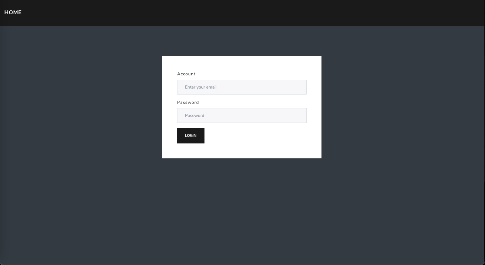
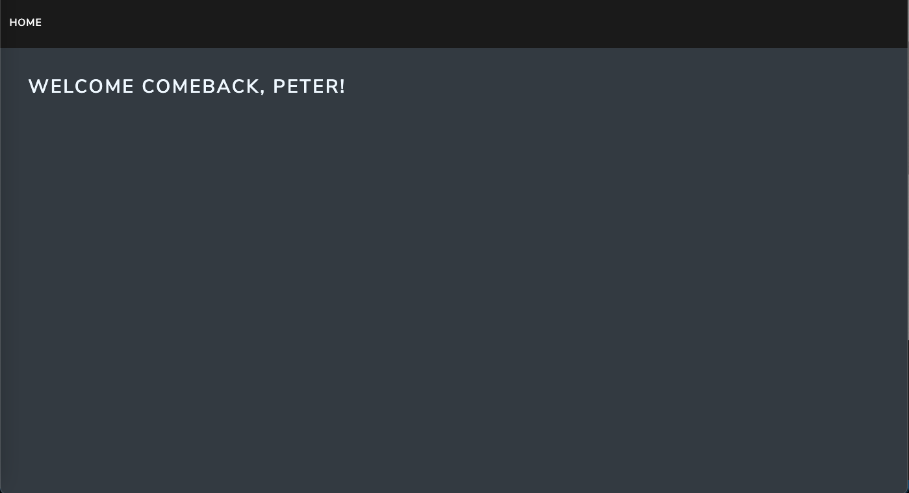

# User Authentication 
A simple login website built with Node.js and Express

# Features
* Check account and password
* Show the message of empty account or password
* Show the message of wrong password or account does not exist




# Getting Started
Clone respository to your local computer
```
$ git clone https://github.com/naluwan/user-login.git
```
Install by npm
```
$ npm install
```
Seeds
```
$ npm run seed
```
Execute
```
$ npm run dev
```
Terminal show the message
```
Express is running on localhost:3000
```
Now you can browse the website on
```
http://localhost:3000
```
# Built With
* Node.js: 10.24.1
* Express: 4.17.1
* Express-Handlebars: 5.3.2
* mongoose: 5.12.12

# Author
NaLuWan 簡碩亨